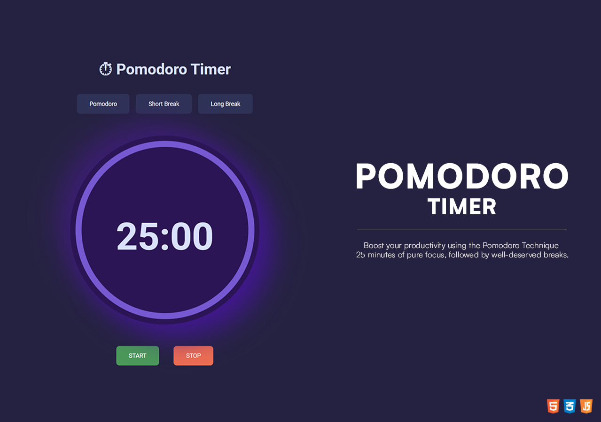

<h1 align="center">⏱︎ POMODORO TIMER</h1>

<em>A simple and lightweight web-based Pomodoro Timer to help you stay focused and productive.</em>

  The <strong>Pomodoro Technique</strong> is a time management method developed by 
  <a href="https://www.francescocirillo.com/">Francesco Cirillo</a>. 
  It uses a timer to break work into intervals – <strong>traditionally 25 minutes of focused work followed by a 5-minute break.</strong> 
  After four sessions, you take a longer break (10–15–30 minutes). 
  This approach helps maintain concentration, reduce burnout, and improve productivity.

 

  

 

